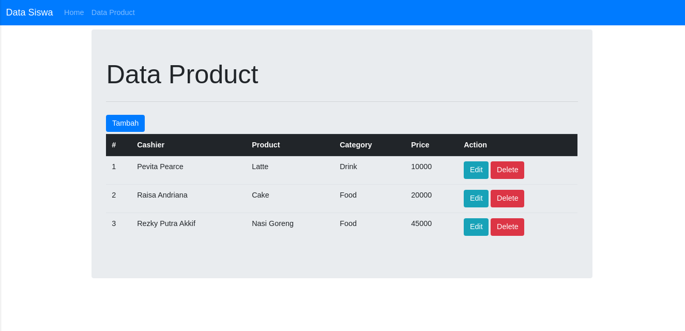
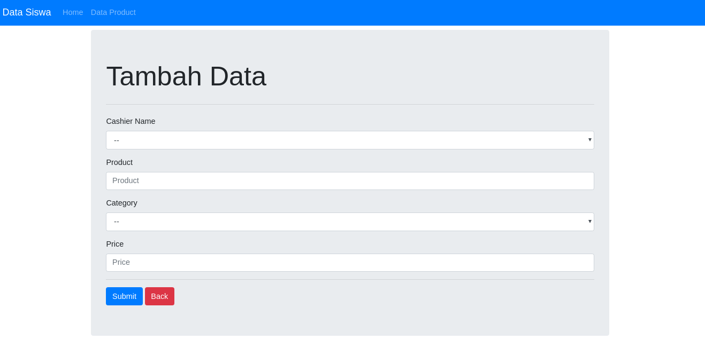
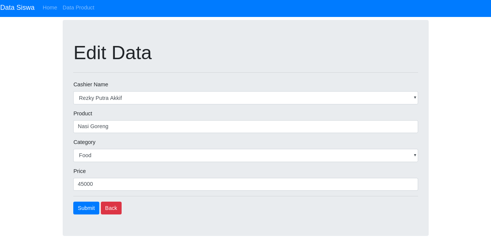
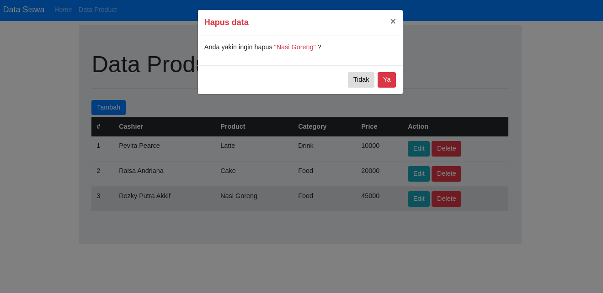

# Seleksi Arkademy

 disini saya menggunakan bahasa Pemrograman php 

# software yang dibutuhkan:
<ul>
  <li> Text Editor (Visual studio code) </li>
  <li> XAMMP </li>
  <li> Composer (soal no 6)</li>
  <li> Web Browser (Google Crome) </li>
</ul>

# Cara Menjalankan aplikasi:
<ul>
  <li>Buat folder nama_folder pada C/xammp/htdoc</li>
  <li>Kemudian clone data pada link github </li>
  <li>buka web browser(Google Crome / Mozilla Firefox) </li>
  <li>lalu klik localhost/nama_folder</li>
</ul>

# Cara install soal nomor 6

1. Clone/download dulu projectnya
3. Install depedency dengan cara "composer install" di folder multiuser manggunakan cmd
4. copy semua file .env.example ke file baru .env dengan cara "cp .env.example .env" di folder multiuser menggunakan cmd
5. ubah setting database pada .env
6. Buat database sesuai setting .env
7. "php artisan key:generate" pada cmd untuk mendapatkan APP_KEY
8. "php artisan migrate --seed" pada cmd untuk memberi table pada database dan meng-insert data didatabase
9. Jalankan projectnya dengan cara "php artisan serve" pada cmd

Nb : di pc harus terinstall composer

# Screenshot

 Index 

 Tambah 

 Edit 

 Delete 

